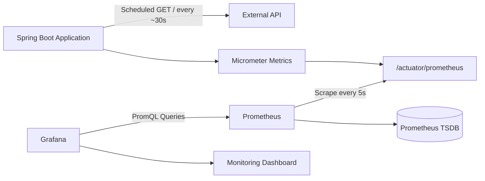

# Spring Boot API Monitoring

A lightweight monitoring project built with **Spring Boot, Micrometer, Prometheus, Grafana, and Docker Compose**.

The application periodically sends HTTP requests to an external API, records request outcomes and latency as custom metrics, exposes them through Spring Boot Actuator, and lets Prometheus collect them for visualization in Grafana.

The project was built as a practical exercise to understand the complete monitoring flow from **application metrics to dashboards**.

---

## Architecture



There are two independent HTTP flows in the project:

```text
Spring Boot  ---> External API
Prometheus   ---> Spring Boot /actuator/prometheus
```

Prometheus does **not** monitor the external API directly.  
The Spring Boot application performs the external check and publishes the resulting metrics.

---

## Tech Stack

- Java 17
- Spring Boot
- Spring Scheduler
- Spring RestClient
- Spring Boot Actuator
- Micrometer
- Prometheus
- PromQL
- Grafana
- Docker Compose
- Maven

---

## What the Application Monitors

The Spring Boot application checks a public external API approximately every 30 seconds.

For every request it records:

- HTTP status code
- Success / failure outcome
- Request duration
- Total request count

Network failures are also recorded without stopping the application.

Example application log:

```text
External API check completed - status=200, success=true, latency=104ms
```

---

## Custom Metrics

### External API Request Counter

Micrometer metric:

```text
external.api.requests
```

Prometheus representation:

```text
external_api_requests_total
```

Labels:

```text
outcome="success|failure"
status_code="200|404|500|none"
```

Example:

```text
external_api_requests_total{
  outcome="success",
  status_code="200"
} 42
```

A network-level failure where no HTTP response is received is represented as:

```text
outcome="failure"
status_code="none"
```

---

### External API Request Duration

Micrometer metric:

```text
external.api.request.duration
```

Prometheus exposes the Timer through series such as:

```text
external_api_request_duration_seconds_count
external_api_request_duration_seconds_sum
external_api_request_duration_seconds_max
```

These metrics are used to calculate average API latency over time.

---

## Automatic JVM Metrics

Spring Boot Actuator and Micrometer also expose runtime metrics automatically.

Examples:

```promql
jvm_memory_used_bytes
```

```promql
jvm_threads_live_threads
```

```promql
process_cpu_usage
```

These metrics are also scraped by Prometheus even though they are not explicitly created in the application code.

---

## Prometheus

Prometheus runs inside Docker and scrapes the Spring Boot application every **5 seconds**.

Configuration:

```yaml
scrape_configs:
  - job_name: external-api-monitor
    scrape_interval: 5s
    metrics_path: /actuator/prometheus
    static_configs:
      - targets:
          - host.docker.internal:8080
```

Because Spring Boot runs on the host machine while Prometheus runs inside Docker, Prometheus accesses the application through:

```text
host.docker.internal:8080
```

---

## Useful PromQL Queries

### Spring Boot scrape status

```promql
up{job="external-api-monitor"}
```

`1` means Prometheus can successfully scrape the Spring Boot application.

`0` means the scrape failed.

> `up=1` does not mean the external API itself is healthy.  
> It only represents the Prometheus → Spring Boot connection.

---

### External API requests

```promql
external_api_requests_total
```

Successful requests:

```promql
sum(
  external_api_requests_total{
    job="external-api-monitor",
    outcome="success"
  }
)
```

---

### Checks during the last 5 minutes

```promql
sum by (outcome) (
  increase(
    external_api_requests_total{
      job="external-api-monitor"
    }[5m]
  )
)
```

---

### Average external API latency

```promql
1000 * (
  increase(
    external_api_request_duration_seconds_sum{
      job="external-api-monitor"
    }[5m]
  )
  /
  increase(
    external_api_request_duration_seconds_count{
      job="external-api-monitor"
    }[5m]
  )
)
```

The result is converted from seconds to milliseconds.

---

## Grafana Dashboard

The project includes a Grafana dashboard named:

```text
External API Monitoring
```

It contains four panels:

### Spring Boot Target Status

Shows whether Prometheus can scrape the application.

```promql
up{job="external-api-monitor"}
```

---

### Successful / Failed Request Count

Shows cumulative external API checks grouped by outcome.

---

### External API Checks - Last 5 Minutes

Shows approximately how many external API checks occurred during the previous five minutes.

This uses `increase()` because the application performs a relatively low-frequency scheduled request.

---

### Average External API Latency

Shows the rolling average latency of external API requests over the previous five minutes.

---

## Dashboard Import

The exported dashboard is stored in:

```text
grafana/external-api-monitoring.json
```

To import it manually:

1. Open Grafana.
2. Go to **Dashboards → New → Import**.
3. Upload:

```text
grafana/external-api-monitoring.json
```

4. Select the Prometheus data source.
5. Click **Import**.

The dashboard JSON is version-controlled in the repository and does not contain metric data itself.

---

## Project Structure

```text
.
├── compose.yaml
├── grafana
│   └── external-api-monitoring.json
├── prometheus
│   └── prometheus.yml
├── src
│   ├── main
│   │   ├── java
│   │   │   └── com/example/monitoring
│   │   │       ├── MonitoringApplication.java
│   │   │       └── monitor
│   │   │           └── ExternalApiMonitor.java
│   │   └── resources
│   │       └── application.yml
│   └── test
│       └── java
│           └── com/example/monitoring
│               └── MonitoringApplicationTests.java
├── pom.xml
├── mvnw
└── README.md
```

---

# Running the Project

## Prerequisites

Make sure the following are installed:

- Java 17
- Docker
- Docker Compose

Maven does not need to be installed globally because the project includes the Maven Wrapper.

---

## 1. Start the Spring Boot Application

From the project root:

```bash
./mvnw spring-boot:run
```

The application starts on:

```text
http://localhost:8080
```

---

## 2. Verify Spring Boot Health

Open:

```text
http://localhost:8080/actuator/health
```

Expected result:

```json
{
  "status": "UP"
}
```

---

## 3. Inspect Exposed Metrics

Open:

```text
http://localhost:8080/actuator/prometheus
```

Search for:

```text
external_api_requests_total
```

and:

```text
external_api_request_duration_seconds
```

---

## 4. Start Prometheus and Grafana

Open another terminal and run:

```bash
docker compose up -d
```

Check the running services:

```bash
docker compose ps
```

---

## 5. Open Prometheus

```text
http://localhost:9090
```

Try:

```promql
up{job="external-api-monitor"}
```

Expected value:

```text
1
```

You can also query:

```promql
external_api_requests_total
```

---

## 6. Open Grafana

```text
http://localhost:3000
```

Default local credentials on a fresh Grafana installation are:

```text
username: admin
password: admin
```

Grafana may ask you to change the password after the first login.

The Prometheus data source should use:

```text
http://prometheus:9090
```

instead of `localhost:9090`, because Grafana and Prometheus run in separate containers on the same Docker Compose network.

---

## Stopping the Project

Stop the Spring Boot application with:

```text
Ctrl + C
```

Stop Prometheus and Grafana with:

```bash
docker compose down
```

---

## Monitoring Flow

The complete data flow is:

```text
External API
     ↑
     │ HTTP GET
     │
Spring Boot
     │
     ├── Counter
     └── Timer
          │
          ▼
      Micrometer
          │
          ▼
 /actuator/prometheus
          ↑
          │ scrape
          │
      Prometheus
          │
          │ PromQL
          ▼
        Grafana
          │
          ▼
       Dashboard
```

This project demonstrates the distinction between:

- producing application metrics,
- exposing metrics,
- scraping metrics,
- storing time-series data,
- querying metrics with PromQL,
- and visualizing them through Grafana.

---

## Scope

The project intentionally keeps the architecture small and focused on monitoring fundamentals.

It does not currently include:

- Alertmanager / notifications
- Distributed tracing
- Loki / centralized logging
- Kubernetes
- Retry or circuit breaker mechanisms
- Persistent Prometheus or Grafana volumes

These can be added separately without changing the core monitoring flow.