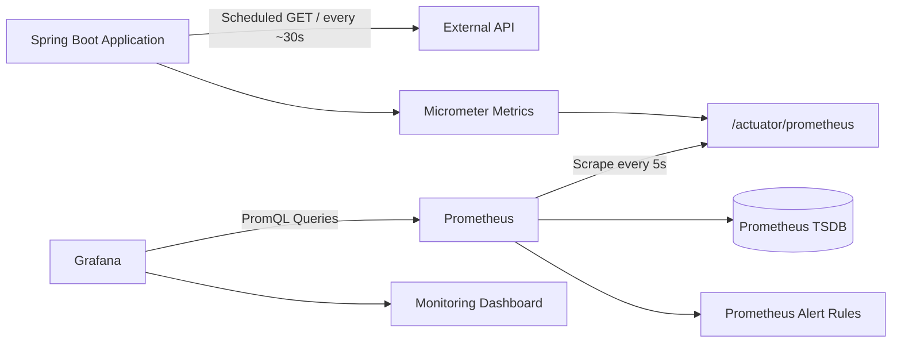

# Spring Boot API Monitoring

A lightweight monitoring project built with **Spring Boot, Micrometer, Prometheus, Grafana, and Docker Compose**.

The application periodically sends HTTP requests to an external API, records request outcomes and latency as custom metrics, exposes them through Spring Boot Actuator, and lets Prometheus collect them for visualization in Grafana.

The project was built as a practical exercise to understand the complete monitoring flow from **application metrics to dashboards and alert rules**.

---

## Architecture



There are two independent HTTP flows in the project:

```text
Spring Boot  ---> External API
Prometheus   ---> Spring Boot /actuator/prometheus
```

Prometheus does **not** monitor the external API directly.

The Spring Boot application performs the external check and publishes the resulting metrics.

Prometheus then collects those metrics, stores them as time-series data, evaluates alert rules, and makes the data available to Grafana.

---

## Tech Stack

- Java 17
- Spring Boot
- Spring Scheduler
- Spring RestClient
- Spring Boot Actuator
- Micrometer
- Prometheus
- PromQL
- Grafana
- Docker Compose
- Maven

---

## Features

- Periodic external API health checks
- HTTP status monitoring
- Success / failure request counters
- Request latency measurement
- Prometheus-compatible metrics endpoint
- Prometheus scraping and time-series storage
- Automatic JVM and process metrics
- Grafana monitoring dashboard
- Prometheus alert rule for recent external API failures

---

## What the Application Monitors

The Spring Boot application checks a public external API approximately every 30 seconds.

For every request it records:

- HTTP status code
- Success / failure outcome
- Request duration
- Total request count

Network failures are also recorded without stopping the application.

Example application log:

```text
External API check completed - status=200, success=true, latency=104ms
```

---

## Custom Metrics

### External API Request Counter

Micrometer metric:

```text
external.api.requests
```

Prometheus representation:

```text
external_api_requests_total
```

Labels:

```text
outcome="success|failure"
status_code="200|404|500|none"
```

Example:

```text
external_api_requests_total{
  outcome="success",
  status_code="200"
} 42
```

A network-level failure where no HTTP response is received is represented as:

```text
outcome="failure"
status_code="none"
```

---

### External API Request Duration

Micrometer metric:

```text
external.api.request.duration
```

Prometheus exposes the Timer through series such as:

```text
external_api_request_duration_seconds_count
external_api_request_duration_seconds_sum
external_api_request_duration_seconds_max
```

These metrics are used to calculate average API latency over time.

---

## Automatic JVM Metrics

Spring Boot Actuator and Micrometer also expose runtime metrics automatically.

Examples:

```promql
jvm_memory_used_bytes
```

```promql
jvm_threads_live_threads
```

```promql
process_cpu_usage
```

These metrics are also scraped by Prometheus even though they are not explicitly created in the application code.

---

## Prometheus

Prometheus runs inside Docker and scrapes the Spring Boot application every **5 seconds**.

Configuration:

```yaml
scrape_configs:
  - job_name: external-api-monitor
    scrape_interval: 5s
    metrics_path: /actuator/prometheus
    static_configs:
      - targets:
          - host.docker.internal:8080
```

Because Spring Boot runs on the host machine while Prometheus runs inside Docker, Prometheus accesses the application through:

```text
host.docker.internal:8080
```

Prometheus stores the collected values as time-series data in its TSDB.

---

## Useful PromQL Queries

### Spring Boot Scrape Status

```promql
up{job="external-api-monitor"}
```

`1` means Prometheus can successfully scrape the Spring Boot application.

`0` means the scrape failed.

> `up=1` does not mean the external API itself is healthy.  
> It only represents the Prometheus → Spring Boot connection.

---

### External API Requests

```promql
external_api_requests_total
```

Successful requests:

```promql
sum(
  external_api_requests_total{
    job="external-api-monitor",
    outcome="success"
  }
)
```

---

### Checks During the Last 5 Minutes

```promql
sum by (outcome) (
  increase(
    external_api_requests_total{
      job="external-api-monitor"
    }[5m]
  )
)
```

`increase()` is used because the application performs a low-frequency scheduled request and the dashboard is interested in how many checks occurred during a recent time window.

---

### Average External API Latency

```promql
1000 * (
  increase(
    external_api_request_duration_seconds_sum{
      job="external-api-monitor"
    }[5m]
  )
  /
  increase(
    external_api_request_duration_seconds_count{
      job="external-api-monitor"
    }[5m]
  )
)
```

The Timer stores duration values in seconds.

The query divides the total duration increase by the number of measured requests and multiplies the result by `1000` to display average latency in milliseconds.

---

## Grafana Dashboard

The project includes a Grafana dashboard named:

```text
External API Monitoring
```

It contains four panels.

### Spring Boot Target Status

Shows whether Prometheus can scrape the application.

```promql
up{job="external-api-monitor"}
```

---

### Successful / Failed Request Count

Shows cumulative external API checks grouped by outcome.

---

### External API Checks - Last 5 Minutes

Shows approximately how many external API checks occurred during the previous five minutes.

This uses `increase()` because the application performs a relatively low-frequency scheduled request.

---

### Average External API Latency

Shows the rolling average latency of external API requests over the previous five minutes.

---

## Dashboard Import

The exported dashboard is stored in:

```text
grafana/external-api-monitoring.json
```

To import it manually:

1. Open Grafana.
2. Go to **Dashboards → New → Import**.
3. Upload:

```text
grafana/external-api-monitoring.json
```

4. Select the Prometheus data source.
5. Click **Import**.

The dashboard JSON is version-controlled in the repository and does not contain metric data itself.

Grafana reads the actual metric data from Prometheus.

---

## Alerting

Prometheus also evaluates a simple alert rule for recent external API failures.

The rule is stored in:

```text
prometheus/alerts.yml
```

The alert is named:

```text
ExternalApiFailureDetected
```

Its condition is:

```promql
increase(
  external_api_requests_total{
    job="external-api-monitor",
    outcome="failure"
  }[5m]
) > 0
```

This checks whether the failure Counter has increased during the previous five minutes.

Using:

```promql
external_api_requests_total{outcome="failure"} > 0
```

would not be appropriate because a Counter only increases. A single old failure could therefore keep the condition true indefinitely.

Using `increase(...[5m])` makes the rule react only to **recent failures**.

The alert is configured with:

```yaml
for: 30s
```

This introduces three possible alert states:

- **Inactive** — the PromQL condition is false.
- **Pending** — the condition is true, but it has not remained true for 30 seconds yet.
- **Firing** — the condition has remained true for at least 30 seconds.

The alert rule also contains:

```yaml
severity: warning
```

This is a label that classifies the alert severity.

The rule contains human-readable annotations such as:

```text
summary: External API check failure detected
description: At least one external API check failed during the last 5 minutes.
```

Prometheus currently **detects and exposes the alert state only**.

No notification delivery system is configured.

An Alertmanager could later receive firing alerts and route them to systems such as:

- Email
- Slack
- Webhooks

Alertmanager is intentionally outside the scope of this project.

---

## Project Structure

```text
.
├── compose.yaml
├── grafana
│   └── external-api-monitoring.json
├── prometheus
│   ├── alerts.yml
│   └── prometheus.yml
├── src
│   ├── main
│   │   ├── java
│   │   │   └── com/example/monitoring
│   │   │       ├── MonitoringApplication.java
│   │   │       └── monitor
│   │   │           └── ExternalApiMonitor.java
│   │   └── resources
│   │       └── application.yml
│   └── test
│       └── java
│           └── com/example/monitoring
│               └── MonitoringApplicationTests.java
├── pom.xml
├── mvnw
└── README.md
```

---

# Running the Project

## Prerequisites

Make sure the following are installed:

- Java 17
- Docker
- Docker Compose

Maven does not need to be installed globally because the project includes the Maven Wrapper.

---

## 1. Start the Spring Boot Application

From the project root:

```bash
./mvnw spring-boot:run
```

The application starts on:

```text
http://localhost:8080
```

---

## 2. Verify Spring Boot Health

Open:

```text
http://localhost:8080/actuator/health
```

Expected result:

```json
{
  "status": "UP"
}
```

---

## 3. Inspect Exposed Metrics

Open:

```text
http://localhost:8080/actuator/prometheus
```

Search for:

```text
external_api_requests_total
```

and:

```text
external_api_request_duration_seconds
```

---

## 4. Start Prometheus and Grafana

Open another terminal and run:

```bash
docker compose up -d
```

Check the running services:

```bash
docker compose ps
```

---

## 5. Open Prometheus

```text
http://localhost:9090
```

Try:

```promql
up{job="external-api-monitor"}
```

Expected value:

```text
1
```

You can also query:

```promql
external_api_requests_total
```

Prometheus rules can be inspected at:

```text
http://localhost:9090/rules
```

Alerts can be inspected at:

```text
http://localhost:9090/alerts
```

---

## 6. Open Grafana

```text
http://localhost:3000
```

Default local credentials on a fresh Grafana installation are:

```text
username: admin
password: admin
```

Grafana may ask you to change the password after the first login.

The Prometheus data source should use:

```text
http://prometheus:9090
```

instead of:

```text
localhost:9090
```

because Grafana and Prometheus run in separate containers on the same Docker Compose network.

---

## Stopping the Project

Stop the Spring Boot application with:

```text
Ctrl + C
```

Stop Prometheus and Grafana with:

```bash
docker compose down
```

---

## Monitoring Flow

The complete monitoring flow is:

```text
External API
     ↑
     │ Scheduled HTTP GET
     │
Spring Boot
     │
     ├── Counter
     └── Timer
          │
          ▼
      Micrometer
          │
          ▼
 /actuator/prometheus
          ↑
          │ Scrape
          │
      Prometheus
       /       \
      /         \
   TSDB       Alert Rules
     │
     │ PromQL
     ▼
   Grafana
     │
     ▼
  Dashboard
```

The project demonstrates the distinction between:

- producing application metrics,
- exposing metrics,
- scraping metrics,
- storing time-series data,
- querying metrics with PromQL,
- visualizing metrics through Grafana,
- and evaluating alert conditions with Prometheus.

---

## Scope

The project intentionally keeps the architecture small and focused on monitoring fundamentals.

It does not currently include:

- Alertmanager and notification delivery
- Distributed tracing
- Loki / centralized logging
- Kubernetes
- Retry or circuit breaker mechanisms
- Persistent Prometheus or Grafana volumes

These can be added separately without changing the core monitoring flow.